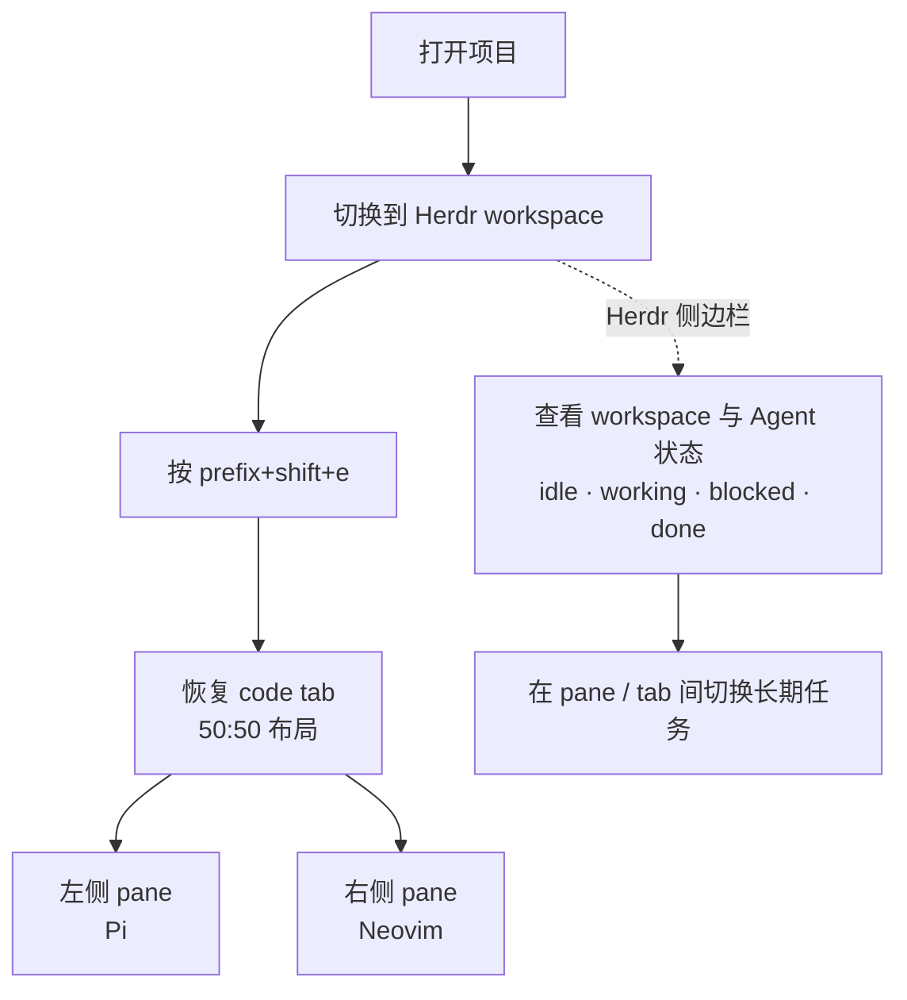

Codex Desktop 很顺手，只是我的 MacBook M1 PRO 跑不起它。四年没有转过的风扇，只要打开codex 就转不停。

所以我使用pi + Herdr + neovim 打造了一个终端中的 codex desktop

- **Herdr** 管工作台：workspace、tab、pane、布局、多 Agent 侧边栏。
- **Pi** 管 Agent：模型循环、工具调用、会话、扩展。
- **Neovim** 管代码：浏览、编辑、Buffer，并通过 `pi-nvim` 把上下文喂给 Pi。

Codex Desktop 一手包办的几件事，在这里被拆给了更适合终端的零件。

## Trace

### Editor ->  Neovim

右侧 pane 固定放 Neovim，查看、编辑和跳转文件都不用离开终端。需要让 Pi 看代码时，`pi-nvim` 可以把当前文件、选区或整个 Buffer 直接送到左侧会话，不用复制粘贴，也不用切回 VS Code。

### Side Chat -> /btw

`/btw` 为 Pi 提供独立 Side Chat：它会在 Herdr 中打开一个带工具能力的 pane，并继承当前目录、模型和 thinking level。Side Chat 拥有独立上下文，支持连续追问，不会改动主会话；需要时再用 `/btw merge` 把结论合并回来。

### Subagent -> pi-subagents

`pi-subagents` 负责把 research、implementation、review 等任务交给独立的子 Agent。启动时可以选择 `fresh` 或 `fork` 上下文，也可以为每个 Agent 指定模型和 thinking level，或者让它们在后台并行工作。配合 Herdr skills，还能像在 Codex Desktop 里一样，打开某个 Subagent 的 pane，直接查看它的对话和进度。

### Goal -> pi-goal

`pi-goal` 让 Pi 可以围绕一个目标持续工作，而不是每完成一轮就停下来等下一条提示。任务受阻时会进入 `blocked`；我也可以随时 `/goal pause`，之后再用 `/goal resume` 从原来的目标继续。

### Web-search & Computer-use

`pi-web-access` 负责搜索和读取网页，也能处理 GitHub、PDF 和视频内容；`pi-computer-use` 负责观察并操作桌面界面，包括定位窗口、点击、输入和滚动。一个解决“找到信息”，另一个解决“替我操作”。

### Compaction -> pi-codex-compaction

`pi-codex-compaction` 在使用 OpenAI Codex 模型时，把原生的上下文压缩能力接进 Pi。Pi 自带的 compaction 在超长任务里经常还是会撞上上下文上限；换成 Codex 的原生 compaction 后，长会话可以继续压缩和恢复，token 也更耐用。

## PROS & CONS

优点很直接：

- 风扇不转了。
- token 更耐用了。
- 以上所有配置都可以让 AI 完成。

缺点也很明显：

- 无法开箱即用，终端操作和 Neovim 都有使用门槛。
- 浏览器和 Computer Use 还比较粗糙，窗口失焦之类的问题也没有完全解决。

这并不适合想要开箱即用的人。虽然 AI 可以帮忙解决 99% 的配置问题，但日常操作仍然需要适应，与 Desktop App 还有差距。

## 软件与插件链接

| 名称                    | 在这套系统中的用途                | 地址                                                      |
| --------------------- | ------------------------ | ------------------------------------------------------- |
| Pi                    | Agent runtime            | [[GitHub](https://github.com/earendil-works/pi)](https://github.com/earendil-works/pi)          |
| Herdr                 | Workspace、布局和多 Agent TUI | [[GitHub](https://github.com/ogulcancelik/herdr)](https://github.com/ogulcancelik/herdr)         |
| Neovim                | 编辑器                      | [[官网](https://neovim.io/)](https://neovim.io/)                                |
| `pi-nvim`             | 将 Neovim 上下文发送给 Pi       | [[GitHub](https://github.com/carderne/pi-nvim)](https://github.com/carderne/pi-nvim)           |
| `pi-web-access`       | 搜索并读取网页内容                | [[GitHub](https://github.com/nicobailon/pi-web-access)](https://github.com/nicobailon/pi-web-access)   |
| `pi-subagents`        | 任务级 Subagent             | [[GitHub](https://github.com/nicobailon/pi-subagents)](https://github.com/nicobailon/pi-subagents)    |
| `pi-herdr-btw`        | 独立 Side Chat             | [[GitHub](https://github.com/oscabriel/pi-herdr-btw)](https://github.com/oscabriel/pi-herdr-btw)     |
| `pi-goal`             | Goal、continuation 与恢复    | [[GitHub](https://github.com/kky42/pi-goal)](https://github.com/kky42/pi-goal)              |
| `pi-codex-compaction` | 接入 Codex 原生 compaction   | [[GitHub](https://github.com/ogulcancelik/pi-extensions)](https://github.com/ogulcancelik/pi-extensions) |
| `pi-computer-use`     | 操作桌面应用                   | [[GitHub](https://github.com/injaneity/pi-computer-use)](https://github.com/injaneity/pi-computer-use)  |
| `pi-mcp-adapter`      | 接入 MCP 服务                | [[GitHub](https://github.com/nicobailon/pi-mcp-adapter)](https://github.com/nicobailon/pi-mcp-adapter)  |