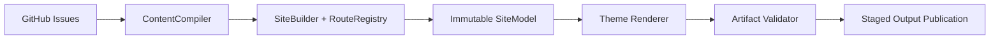

<div align="center">


# escaping

**把 GitHub Issues 编译成一个完整、可靠、可部署的个人网站。**

一个 opinionated personal-site generator：以 Issues 为内容源，经由不可变模型、严格校验与分阶段发布，生成 Blog、Ideas、Projects、About、Tags、Atom 和完整 SEO artifacts。

[](https://www.python.org/)
[](https://docs.github.com/issues)
[](https://geoqiao.me/)
[](LICENSE)

**[线上站点](https://geoqiao.me/)** · **[快速开始](#-快速开始)** · **[配置示例](config.example.yaml)** · **[完整指南](docs/detailed-guide.md)** · **[部署契约](docs/deployment.md)**

</div>

---

## ✨ 为什么是 escaping？

`escaping` 不把 GitHub Issues 当作一组需要即时渲染的数据，而是把它们当作一次确定性编译的输入。每次构建都会先完成内容解析、路由分配、HTML sanitization 和产物校验；只有整站通过后，才会通过可回滚的目录 rename 发布当前输出。

这让一个轻量的个人站同时拥有清晰的内容工作流和可靠的发布边界：

| | 能力 | 行为 |
| --- | --- | --- |
| ✍️ | **Issues as content** | Blog、Ideas 与 About 来自带标签和 front matter 的 GitHub Issues |
| 🧭 | **完整站点模型** | 统一生成 Home、归档、详情、Projects、Tags、Atom、sitemap 与 robots |
| 🎨 | **可替换 Theme** | 内置 `geoqiao.me`、`Escape1`、`Escape2`，也支持 Config-relative 本地 Theme |
| 🔒 | **默认安全** | Markdown HTML allowlist、严格 URL 校验、输出目录 containment、Jinja autoescape |
| 🔗 | **单一路由来源** | `RouteRegistry` 统一生成 canonical URL 与文件输出路径，避免手工拼接 |
| 🚀 | **分阶段发布** | 新产物在 staging 中渲染和验证，再通过目录 rename 与 rollback 替换本地输出 |

## 🧭 编译流水线



Renderer 和 artifact validator 只读取同一份 `SiteModel`。Theme 作为已经加载的依赖注入渲染层，因此内容、路由和发布安全不会散落到模板里。

## 🚀 快速开始

需要 Python 3.11+、[`uv`](https://docs.astral.sh/uv/) 和一个可读取目标仓库 Issues 的 GitHub Token。

```bash
git clone https://github.com/geoqiao/escaping.git
cd escaping
uv sync

mkdir -p ../my-site
cp config.example.yaml ../my-site/config.yaml
# 编辑 ../my-site/config.yaml

export GITHUB_TOKEN=...
uv run escpe --config ../my-site/config.yaml
uv run python -m http.server 8000 --directory ../my-site/output
```

打开 <http://localhost:8000>。`output/` 是 HTTP document root，不是 URL 中的 `/output/` 前缀。

最小配置的关键部分：

```yaml
github:
  repo: username/username.github.io
  allowed_authors:
    - username

site:
  title: Blog Title
  url: https://username.github.io/
  author: Your Name
  description: Short description
  language: zh-CN

profile:
  avatar: https://github.com/username.png
  links:
    - name: GitHub
      url: https://github.com/username

about:
  issue_number: 1

security:
  token_env: GITHUB_TOKEN
```

Blog slug 由 Issue front matter 显式提供，不从标题推导；About 由不可变 Issue number 选择。完整字段见 [`config.example.yaml`](config.example.yaml)，内容格式见 [`Issue Content v1`](docs/contracts/issue-content-v1.md)。

默认 `geoqiao.me` 会优先使用 `profile.avatar`，未配置时回退到内置 mark；
它不会把 Site Thesis、tagline 或 profile bio 放到首页。为兼容本地 Theme，这些字段
仍被 Schema 接受并进入 `SiteModel`，具体展示由 Theme 决定。

> [!NOTE]
> Config 中的 output 和本地 Theme 等相对路径，始终以 **Config 文件所在目录** 为根，因此命令可以从任意工作目录执行。

## 🗺️ 页面与路由

| 页面 | Canonical route |
| --- | --- |
| Home | `/` |
| Blog archive / detail | `/blog/` · `/blog/{slug}/` |
| Ideas archive / detail | `/ideas/` · `/ideas/{issue_number}/` |
| Projects | `/projects/` |
| Tags | `/tags/` · `/tags/{tag}/` |
| About | `/about/` |
| Feed / discovery | `/atom.xml` · `/sitemap.xml` · `/robots.txt` |

## 🔗 Config-owned origin 与历史 URL

canonical origin 由站点仓库的 Site Config 所有：`site.url` 是输入值，生产站点当前配置为
`https://geoqiao.me/`。生成器仓库不持有生产 `config.yaml`；RouteRegistry、canonical、
Open Graph、Atom、sitemap 和 robots 都从调用时传入的 origin 派生，所以同一个 compiler
也可以服务其它站点。

以下两种 URL 迁移不要混为一谈：

- **旧 `.html` Blog URL：** compiler 不生成 `/blog/{slug}.html`，也不生成 alias 或
  redirect。这是 [`ADR-0003`](docs/adr/0003-drop-legacy-html-urls.md) 的既有决定。
- **拼音 slug migration：** 站点仓库可以维护显式的、一次性的
  `/blog/old-pinyin-slug/` → `/blog/new-english-slug/` mapping，在 compiler 生成新
  canonical 页面后，由 site-owned `render_slug_redirects.py` 写入兼容页。这不是
  标题推导 slug，也不是 compiler 对旧 `.html` URL 的例外；边界见
  [`ADR-0005`](docs/adr/0005-site-owned-blog-slug-migration-redirects.md)。

## 🎨 Themes

不写 Theme 配置时，默认使用中文优先的内置 `geoqiao.me`；`Escape1` 和
`Escape2` 仍作为可选内置 Theme：

```yaml
theme:
  source: builtin
  name: geoqiao.me # 也可以是 Escape1 或 Escape2
```

也可以加载站点仓库中的本地 Theme：

```yaml
theme:
  source: local
  name: my-theme
  path: theme
```

`ThemeLoader` 只加载 package resources 或本地目录，不隐式执行 Git/HTTP fetch、cache 或 update。三个内置 Theme 共用生成器维护的 `comments.js`，包含 Utterances 自动主题同步、消息来源校验与 Safari lazy iframe 兼容处理。

## 🏗️ 生成器与站点分离

`escaping` 只拥有 compiler、models、validators、示例 Config、内置 Themes 和可复制的
workflow 模板。真实站点仓库拥有自己的 `config.yaml`、Pages workflow、`CNAME`，以及
可选的本地 Theme。

生产 workflow 应 pin `escaping` 的 reviewed release 或完整 40 字符 commit SHA，并使用短期
`GITHUB_TOKEN` 构建 Pages artifact。实际站点 workflow 由
[站点仓库 Pages workflow](https://github.com/geoqiao/geoqiao.github.io/blob/main/.github/workflows/pages.yml)
作为 source of truth；这样生成器与站点即使无法原子变更，也能通过固定版本验证、升级和回滚。
完整要求见
[`docs/deployment.md`](docs/deployment.md) 与
[`Pages workflow 模板`](docs/deployment/geoqiao-pages.yml)。

## 🧪 开发与验证

```bash
uv sync
uv run pytest -q
uv run ruff check src/escaping tests
uv run ruff format --check src/escaping tests
uv run ty check
git diff --check
```

wheel consumer 测试会在源码目录之外构建代表性站点，验证 package resources、默认 Theme 与 Config-root 路径。
旧 `.html` Blog URL 不生成 alias 或 redirect；站点仓库若有拼音 slug migration，则在编译后独立执行
site-owned redirect 后处理。决策分别记录于
[`ADR-0003`](docs/adr/0003-drop-legacy-html-urls.md) 和
[`ADR-0005`](docs/adr/0005-site-owned-blog-slug-migration-redirects.md)。

## 📄 License

[MIT](LICENSE) © geoqiao
