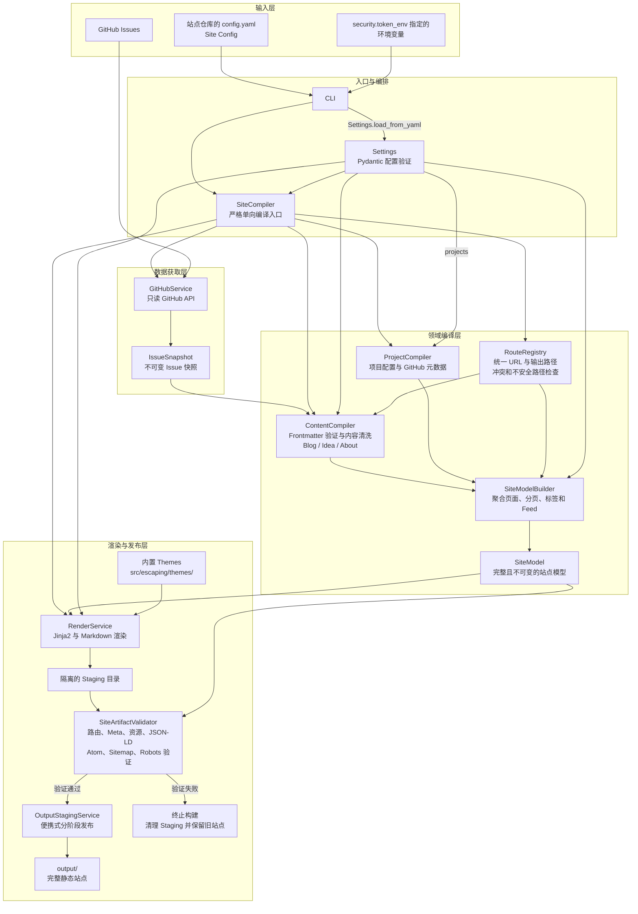
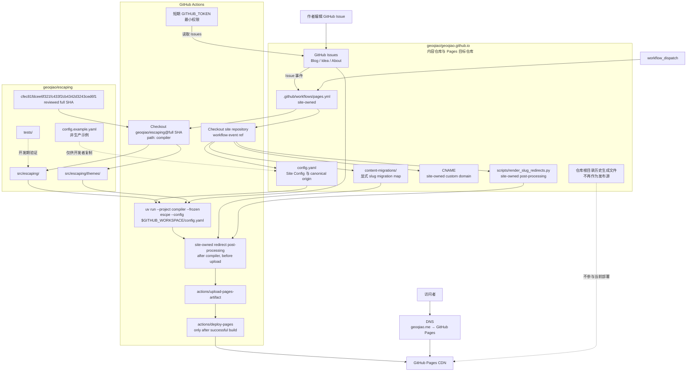

# 当前代码架构与双仓库 Pages Artifact 部署

## 当前职责

geoqiao.me 使用两个仓库，但只有一个内容权威来源：

| 仓库 | 职责 |
|---|---|
| `geoqiao/escaping` | Site Compiler 源码、内置 Themes、`config.example.yaml` 和可复制的 Pages workflow 模板（非生产 workflow） |
| `geoqiao/geoqiao.github.io` | GitHub Issues 内容、真实 `config.yaml`、Pages workflow、`CNAME`、可选本地 Theme 和站点迁移脚本 |

GitHub Issue 是 Blog、Idea、About 的唯一内容来源。`escaping` 只读 Issues，
不会创建、编辑、删除、加标签或发布 Issue。

生产 `config.yaml` 只属于站点仓库；生成器仓库只提供
[`config.example.yaml`](../config.example.yaml)。同样，生产 Pages workflow 只在
站点仓库执行，生成器仓库中的模板只是供站点仓库复制和修改的文档材料。

源码中的内置 Theme 位于 `src/escaping/themes/`，不再有旧的 `templates/` 源码目录。
构建产物中可能出现 `/templates/<theme>/` 这样的静态资源 URL，那是输出约定，不是
Theme 的源码路径。

## Site Compiler 代码架构



关键边界：

- `Settings` 显式传入 `SiteCompiler`，再由编排层把完整配置或对应配置段传给下游组件，不存在全局配置单例；
- `RouteRegistry` 是 canonical URL 与输出路径的唯一注册入口；
- 渲染只消费内部 `SiteModel`，不会直接读取 GitHub Issue；
- 新产物必须在 Staging 中完整验证，验证成功后才会通过目录 rename 与 rollback 发布到
  `output/`；成功替换本地旧输出时允许短暂路径空窗。

## 生产流程



Issue comments 不触发静态构建，因为 Utterances 会实时读取评论。Open/closed 状态不
决定发布状态；只有 `published` label 控制发布。

这里的 `main` 只属于站点仓库的生产 deploy guard，不是编译器的依赖版本。当前 workflow
先 checkout 站点仓库，再用 `actions/checkout` 的 `repository`、`ref` 和 `path` 参数
把生成器 checkout 到 `compiler/`；生成器 `ref` 必须是审核过的 release 或完整 40 字符
SHA，不能是 moving `main`。

## Workflow 所在位置

生产 workflow 必须位于内容/Pages 仓库：

```text
geoqiao/geoqiao.github.io/.github/workflows/pages.yml
```

当前生产文件可在
[站点仓库的 Pages workflow](https://github.com/geoqiao/geoqiao.github.io/blob/main/.github/workflows/pages.yml)
核对。本仓库提供可复制的
[Pages workflow 模板](deployment/geoqiao-pages.yml)；模板不会被 `escaping` 自己执行，
复制后必须由站点仓库持有真实 `config.yaml`、workflow、`CNAME` 和站点迁移文件。

模板以及当前站点 workflow 使用：

- `actions/checkout@v4`
- `astral-sh/setup-uv@v6`
- `actions/upload-pages-artifact@v3`
- `actions/deploy-pages@v4`
- `contents: read`
- `issues: read`
- `pages: write`
- `id-token: write`
- `GITHUB_TOKEN: ${{ github.token }}`

workflow 不会 clone、push 生成文件，不使用个人 PAT、`G_T`、
`repository_dispatch` 或 `issue_comment`。

## Site-owned slug migration 后处理

编译器先根据当前 Issue front matter 生成新的 canonical Blog 路由。对于一次性的内容
slug 迁移，站点仓库可以在编译成功后、上传 Pages artifact 前运行：

```text
python3 scripts/render_slug_redirects.py --map content-migrations/blog-slugs-2026-08.json --output output
```

当前站点的 mapping 显式把旧的拼音式 `/blog/{slug}/` 路由指向新的英文 slug。脚本只
在目标 canonical 页面已经存在且旧源路径不再占用时写入静态兼容页；源页面仍是当前
canonical 时跳过，源和目标都不存在或同时存在则失败。这是站点仓库拥有的迁移后处理，
不是 `RouteRegistry` 的自动 slug 推导，也不把旧 `.html` 路由重新加入生成器；边界见
[`ADR-0005`](adr/0005-site-owned-blog-slug-migration-redirects.md) 和
[`ADR-0003`](adr/0003-drop-legacy-html-urls.md)。

## Pages 设置

在 `geoqiao.github.io` 的 Settings → Pages 中：

1. Build and deployment → Source 选择 **GitHub Actions**；
2. Custom domain 设置为 `geoqiao.me`；
3. 确认证书可用并启用 **Enforce HTTPS**。

这些设置和 `CNAME` 都属于站点仓库/Pages 运维边界，不是生成器的运行时状态。`site.url`
是站点 Config-owned 的 canonical origin，生产站点当前以 `https://geoqiao.me/` 作为该
输入；RouteRegistry、canonical、Feed、sitemap 和 robots 都从这个输入派生。

`geoqiao.me` 的 apex DNS 应只保留 GitHub Pages 的四条 A 记录：

```text
185.199.108.153
185.199.109.153
185.199.110.153
185.199.111.153
```

可选的 `www` 应直接 CNAME 到 `geoqiao.github.io`。不得保留旧 Hostinger parking
IP 或其它冲突的 A、AAAA、ALIAS、ANAME 记录。

## Token 规则

生产 workflow 不需要用户创建或保存个人 GitHub PAT。GitHub Actions 会提供短期的
`GITHUB_TOKEN`，`config.yaml` 通过 `security.token_env` 动态读取它：

```yaml
security:
  token_env: GITHUB_TOKEN
```

本地手动构建仍需要一个能读取公开或私有 Issues 的运行时凭证；凭证只通过环境变量
注入，不写入配置、Issue、workflow 或日志。不要把密码、Token、Cookie 提交到仓库
或发送给 Agent。

## 当前 consumer pin（稳定契约，不是运行快照）

当前 `geoqiao.github.io` workflow 使用以下完整 40 字符 SHA：

```text
geoqiao/escaping@cfec81fdcee6f321fc433f2cb4342d3243ced6f1
```

该 pin 对应当前已验证的 Theme、路由、Config schema、sanitization 和 artifact
validation 组合。升级时先验证站点 consumer，再更新站点仓库的 pin；回滚时恢复上一个
已验证的完整 SHA，并按
[`docs/deployment.md`](deployment.md) 的 Config 兼容规则重新运行 workflow。

这里不记录某次运行的 commit 缩写、Pages artifact 编号、Actions run ID 或证书签发
快照：这些是会过期的站点运维观测，不是双仓库架构契约。需要确认实时部署时，应直接
查看站点 workflow、Pages 设置和当前 artifact。

## Publication safety boundaries

Live Pages protection and local output protection are separate:

- The Site Orchestrator deploy job depends on a successful build and artifact upload. A failed
  build therefore leaves the currently deployed Pages artifact untouched.
- The Site Compiler renders and validates a complete candidate in an owned staging directory
  before local publication begins. Compile, render, or validation failures leave an existing
  local `output` tree unchanged.
- Local publication uses portable directory renames. When output already exists, the compiler
  renames it to an owned sibling backup, promotes staging, and restores the backup if promotion
  fails. A successful local rebuild may briefly have no output path between those renames; it
  never copies a partial candidate into output file by file.

Staging ownership checks run before each mutation. The interval between a check and its mutation
is a known local TOCTOU window and is not closed by this design. Concurrent local builds targeting
the same output directory are unsupported; the compiler does not provide a build lock.
