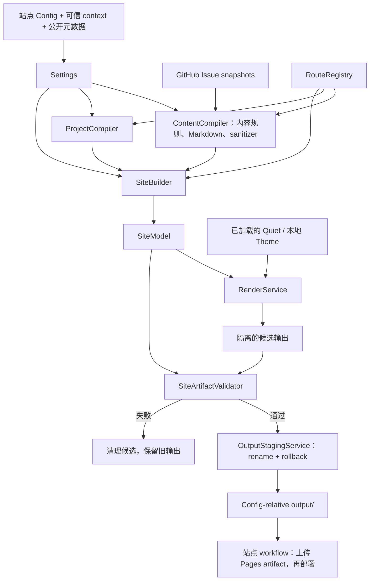

# 生成器与站点的职责

`escaping` 负责生成可靠的静态站点；站点仓库拥有内容、配置和生产部署。

| 所属 | 职责 |
| --- | --- |
| 生成器仓库 | Site Compiler、models、validators、Quiet、`config.example.yaml` 和可复制的 starter |
| 站点仓库 | GitHub Issues、真实 `config.yaml`、Pages workflow、`CNAME`、可选本地 Theme 和历史迁移 |

Site Compiler 只读 GitHub；可选 Local Draft authoring 与站点自动化的写入权限独立，
不属于编译过程。Quiet 是唯一内置 Theme，本地 Theme 使用相同的 API 2。

## 编译与发布

Renderer 和 validator 只读 `SiteModel`，不读 Settings 或原始 Issues。
`RouteRegistry` 唯一构造完整 Route；Theme/output 相对路径以 Config 目录为根。
本地目录发布与线上 Pages artifact 发布是两个独立边界，不承诺跨仓库原子升级。

## 权威文档

| 主题 | 来源 |
| --- | --- |
| 输入来源、作者授权、默认值 | [Site inputs](site-inputs.md) |
| 内容与发布标签 | [Issue Content v1](contracts/issue-content-v1.md) |
| Theme API、安全与迁移 | [Theme authoring](themes/authoring.md) |
| 版本选择、短期 Token、安装、发布与回滚 | [Deployment contract](deployment.md) |
| 通用站点自动化 | [Starter](../starter/README.md) 与 [canonical workflow](../starter/.github/workflows/pages.yml) |
| 历史 URL 的站点自管边界 | [ADR-0003](adr/0003-drop-legacy-html-urls.md)、[ADR-0005](adr/0005-site-owned-blog-slug-migration-redirects.md) |

生产 Config、generator pin、Pages 设置、DNS 与部署记录以各站点仓库和平台当前状态为准；
本仓库不复制个人站点的运维快照。
