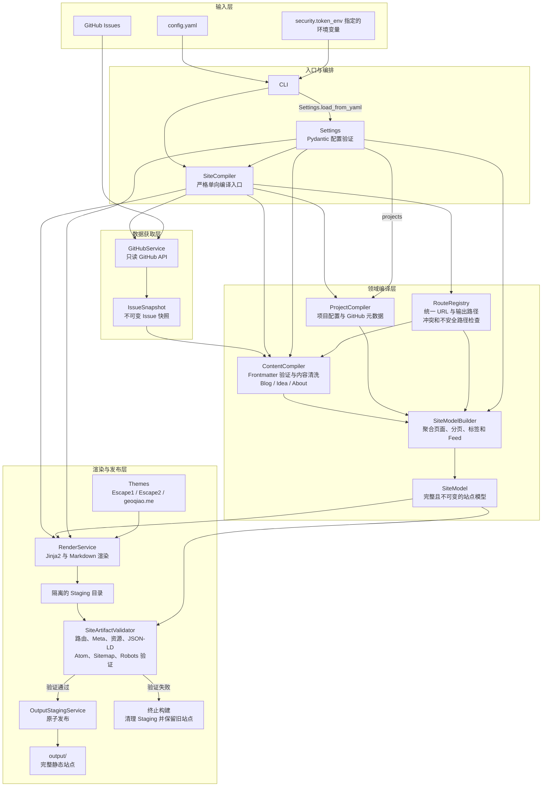
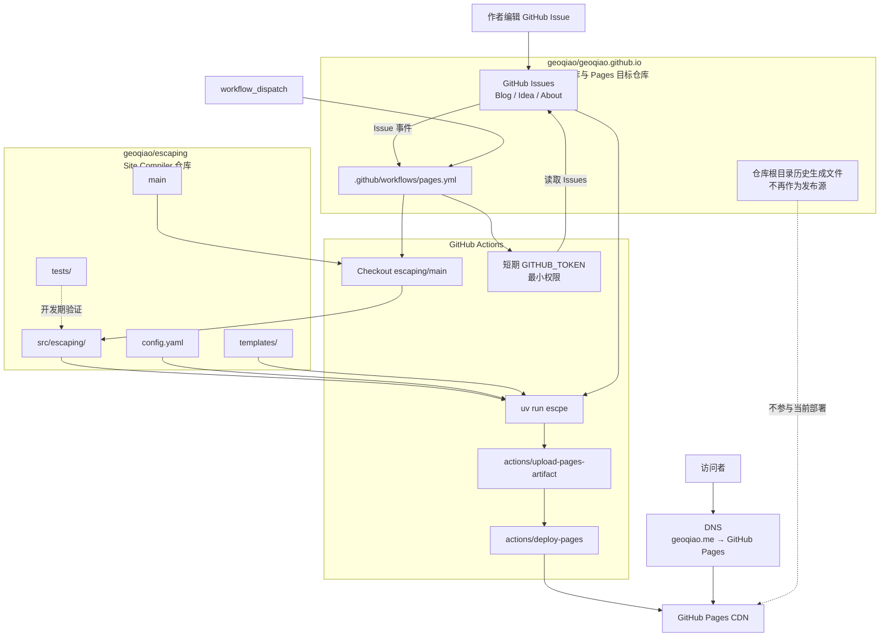
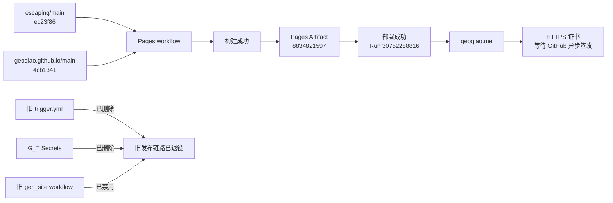

# 当前代码架构与双仓库 Pages Artifact 部署

## 当前职责

`geoqiao.me` 使用两个仓库，但只有一个内容权威来源：

| 仓库 | 职责 |
|---|---|
| `geoqiao/escaping` | Site Compiler 源码、主题、配置和部署 workflow 模板 |
| `geoqiao/geoqiao.github.io` | GitHub Issues 内容、Pages workflow、Pages 发布目标 |

GitHub Issue 是 Blog、Idea、About 的唯一内容来源。`escaping` 只读 Issues，
不会创建、编辑、删除、加标签或发布 Issue。

## Site Compiler 代码架构



关键边界：

- `Settings` 显式传入 `SiteCompiler`，再由编排层把完整配置或对应配置段传给下游组件，不存在全局配置单例；
- `RouteRegistry` 是 canonical URL 与输出路径的唯一注册入口；
- 渲染只消费内部 `SiteModel`，不会直接读取 GitHub Issue；
- 新产物必须在 Staging 中完整验证，验证成功后才会原子替换现有 `output/`。

## 生产流程



Issue comments不触发静态构建，因为 Utterances 会实时读取评论。Open/closed 状态
不决定发布状态；只有 `published` label 控制发布。

## Workflow 所在位置

生产 workflow 必须位于内容/Pages 仓库：

```text
geoqiao/geoqiao.github.io/.github/workflows/pages.yml
```

本仓库提供可复制的模板：

```text
docs/deployment/geoqiao-pages.yml
```

模板使用：

- `actions/checkout@v4`
- `astral-sh/setup-uv@v6`
- `actions/upload-pages-artifact@v3`
- `actions/deploy-pages@v4`
- `contents: read`
- `issues: read`
- `pages: write`
- `id-token: write`
- `GITHUB_TOKEN: ${{ github.token }}`

模板不会 clone、push 生成文件，不使用个人 PAT、`G_T`、
`repository_dispatch` 或 `issue_comment`。

## Pages 设置

在 `geoqiao.github.io` 的 Settings → Pages 中：

1. Build and deployment → Source 选择 **GitHub Actions**；
2. Custom domain 设置为 `geoqiao.me`；
3. DNS 稳定后启用 **Enforce HTTPS**。

`geoqiao.me` 的 apex DNS 应只保留 GitHub Pages 的四条 A 记录：

```text
185.199.108.153
185.199.109.153
185.199.110.153
185.199.111.153
```

可选的 `www` 应直接 CNAME 到 `geoqiao.github.io`。不得保留旧 Hostinger parking
IP 或其它冲突的 A、AAAA、ALIAS、ANAME 记录。

## Token 规则

生产 workflow 不需要用户创建或保存个人 GitHub PAT。GitHub Actions 会提供短期的
`GITHUB_TOKEN`，`config.yaml` 通过 `security.token_env` 动态读取它：

```yaml
security:
  token_env: GITHUB_TOKEN
```

本地手动构建仍需要一个能读取公开或私有 Issues 的运行时凭证；凭证只通过环境变量
注入，不写入配置、Issue、workflow 或日志。不要把密码、Token、Cookie 提交到仓库
或发送给 Agent。

## 当前生产状态

以下是 2026-08-02 完成生产切换后的快照：



生产切换已经完成：

- Pages 发布源是 GitHub Actions 上传的 artifact，不是目标仓库根目录；
- 旧 `trigger.yml`、`G_T` secrets 和 branch-root 发布链路已经退役；
- 历史 `.html` URL 不保留 redirect 或兼容别名；
- DNS 已指向 GitHub Pages；当前唯一待完成的运维项是证书签发后启用 **Enforce HTTPS**。
