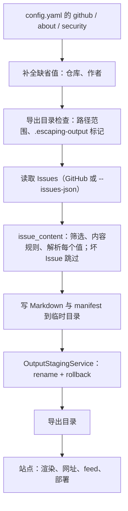

# 维护者入口：架构与文档

写作与建站从 [README](../README.md) 和 [escaping-template](https://github.com/geoqiao/escaping-template) 开始。
维护 `escaping` 时先读 [CONTEXT.md](../CONTEXT.md) 与相关 [ADR](adr/)，再按任务查下表；
验证步骤见[测试指南](agents/testing.md)，Agent 另读 [AGENTS.md](../AGENTS.md)。
每个版本的变化和升级步骤见 [CHANGELOG](../CHANGELOG.md)。

## 三个仓库的职责

| 所属 | 职责 |
| --- | --- |
| `escaping`（本仓库） | 把已发布的 Issue 写成 Markdown 和 manifest；维护 Issue Content 与 Content Export 两份契约；发布 PyPI 上的 `escaping-site` |
| `escaping-template` | 一个完整的站点：默认主题、导出与部署的 workflow。用户用 **Use this template** 复制后归用户所有 |
| 站点仓库 | GitHub Issues、`config.yaml`、站点代码（主题）、workflow、域名和部署 |

主题就是读导出文件的站点代码。默认主题和用户自己写的主题依赖同一份
[Content Export v1](contracts/content-export-v1.md)，没有第二份主题契约
（[ADR-0013](adr/0013-escaping-exports-markdown-the-site-renders.md)）。

## 导出

```mermaid
flowchart TD
    Config["config.yaml 的 github / about / security"] --> Settings["补全缺省值：仓库、作者"]
    Settings --> Safety["导出目录检查：路径范围、.escaping-output 标记"]
    Safety --> Fetch["读取 Issues（GitHub 或 --issues-json）"]
    Fetch --> Core["issue_content：筛选、内容规则、解析每个值；坏 Issue 跳过"]
    Core --> Write["写 Markdown 与 manifest 到临时目录"]
    Write --> Publish["OutputStagingService：rename + rollback"]
    Publish --> Output["导出目录"]
    Output --> Site["站点：渲染、网址、feed、部署"]
```

Config 和导出目录的问题在访问 GitHub 之前就会报错，不产生半成品。
单个 Issue 的内容错误只跳过该 Issue，其余照常导出，CLI 以状态码 2 结束。
导出失败时上一次的导出原样保留。同样的 Issue 得到逐字节相同的文件。

## 权威文档

| 主题 | 来源 |
| --- | --- |
| 内容与发布标签 | [Issue Content v1](contracts/issue-content-v1.md) |
| 导出的文件、manifest、命令与 Config | [Content Export v1](contracts/content-export-v1.md) |
| 可选草稿创作辅助 | [Local Draft v1](contracts/local-draft-v1.md)、[只读 lint](../.agents/skills/issue-draft-lint/SKILL.md)、[一次性创建 Issue，经明确授权才同时发布](../.agents/skills/issue-draft-uploader/SKILL.md)；不是同步或导出入口 |
| workflow、版本 pin、短期 Token、安装、发布与回滚 | [Deployment](deployment.md) |
| 版本变化与升级步骤 | [CHANGELOG](../CHANGELOG.md) |
| 环境、局部检查与合并前验证 | [测试指南](agents/testing.md)、[CI](../.github/workflows/ci.yml)、[PR 模板](../.github/pull_request_template.md) |
| 术语与架构取舍 | [CONTEXT.md](../CONTEXT.md)、[ADR 目录](adr/)、[domain 文档约定](agents/domain.md) |
| 维护任务与标签 | [GitHub tracker](agents/issue-tracker.md)、[triage 标签约定](agents/triage-labels.md) |

站点的 Config、版本 pin、托管设置、DNS 与部署记录以各站点仓库和平台当前状态为准；
本仓库不复制个人站点的运维快照。
