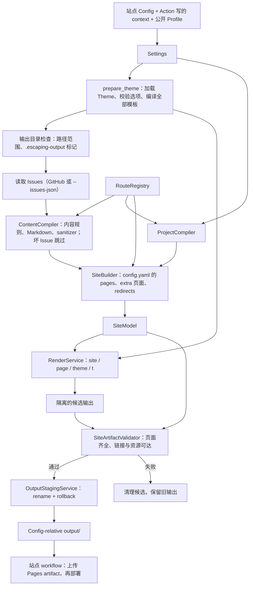

# 维护者入口：架构与文档

建站与写作从 [README](../README.md) 和[模板说明](../starter/README.md)开始。
维护生成器时先读 [CONTEXT.md](../CONTEXT.md) 与相关 [ADR](adr/)，再按任务查下表；
验证步骤见[测试指南](agents/testing.md)，Agent 另读 [AGENTS.md](../AGENTS.md)。
每个版本的变化和升级步骤见 [CHANGELOG](../CHANGELOG.md)。

## 生成器与站点的职责

`escaping` 负责生成可靠的静态站点；站点仓库拥有内容、配置和生产部署。

| 所属 | 职责 |
| --- | --- |
| 生成器仓库 | Site Compiler、models、validators、Quiet、可复用 Action（`action.yml`）、`config.example.yaml` 和可复制的 starter |
| 站点仓库 | GitHub Issues、真实 `config.yaml`、调用 Action 的 Pages workflow、`CNAME`、可选本地 Theme 和历史迁移 |

核心分工：**生成器只管数据，Theme 只管呈现**（[ADR-0008](adr/0008-theme-api-3-data-presentation-split.md)）。
Quiet 是唯一内置 Theme，和本地 Theme 一样使用 Theme API 4，没有特殊待遇。站点也可以用 `github.com/OWNER/REPOSITORY/FOLDER@VERSION` 选用公开 GitHub 仓库里的 Theme，每次构建按这个版本下载，构建结束即删除。

Site Compiler 只读 GitHub；可选 Local Draft authoring 与站点自动化的写入权限独立，
不属于编译过程。站点 workflow 通过 `uses: geoqiao/escaping@<tag 或完整 SHA>` 调用
Action，站点仓库里不再放安装或构建脚本。

## 编译与发布

```mermaid
flowchart TD
    Inputs["站点 Config + Action 写的 context + 公开 Profile"] --> Settings
    Settings --> Prepare["prepare_theme：加载 Theme、校验选项、编译全部模板"]
    Prepare --> Safety["输出目录检查：路径范围、.escaping-output 标记"]
    Safety --> Fetch["读取 Issues（GitHub 或 --issues-json）"]
    Fetch --> ContentCompiler["ContentCompiler：内容规则、Markdown、sanitizer；坏 Issue 跳过"]
    Settings --> ProjectCompiler
    RouteRegistry --> ContentCompiler
    RouteRegistry --> ProjectCompiler
    RouteRegistry --> SiteBuilder
    ContentCompiler --> SiteBuilder["SiteBuilder：config.yaml 的 pages、extra 页面、redirects"]
    ProjectCompiler --> SiteBuilder
    SiteBuilder --> SiteModel
    SiteModel --> RenderService["RenderService：site / page / theme / t"]
    Prepare --> RenderService
    RenderService --> Staging["隔离的候选输出"]
    Staging --> Validator["SiteArtifactValidator：页面齐全、链接与资源可达"]
    SiteModel --> Validator
    Validator -->|通过| Publication["OutputStagingService：rename + rollback"]
    Validator -->|失败| Stop["清理候选，保留旧输出"]
    Publication --> Output["Config-relative output/"]
    Output --> Orchestrator["站点 workflow：上传 Pages artifact，再部署"]
```

Config、Theme 和输出目录的问题在访问 GitHub 之前就会报错，不产生半成品。
单个 Issue 的内容错误只跳过该 Issue，其余照常发布，CLI 以状态码 2 结束。
Renderer 和 validator 只读 `SiteModel` 与已加载的 Theme，不读 Settings 或原始 Issues。
`RouteRegistry` 唯一构造完整 Route，包括 `config.yaml` 的 `pages.extra` 页面，并给子路径站点加上路径前缀；
Theme 与输出目录的相对路径以 Config 所在目录为根。
本地目录发布与线上 Pages artifact 发布是两个独立边界，不承诺跨仓库原子升级。

## 权威文档

| 主题 | 来源 |
| --- | --- |
| 输入来源、两层 Config、默认值、本地构建 | [Site inputs](site-inputs.md) |
| 内容与发布标签 | [Issue Content v1](contracts/issue-content-v1.md) |
| 可选草稿创作辅助 | [Local Draft v1](contracts/local-draft-v1.md)、[只读 lint](../.agents/skills/issue-draft-lint/SKILL.md)、[一次性创建 Issue，经明确授权才同时发布](../.agents/skills/issue-draft-uploader/SKILL.md)；不是同步或编译入口 |
| Theme API 4、选项、字符串与迁移 | [Theme authoring](themes/authoring.md)；默认外观见 [Quiet](themes/quiet.md) |
| Action、版本 pin、短期 Token、安装、发布与回滚 | [Deployment contract](deployment.md) |
| 通用站点自动化 | [Action](../action.yml)、[Starter](../starter/README.md) 与 [starter workflow](../starter/.github/workflows/pages.yml) |
| 版本变化与升级步骤 | [CHANGELOG](../CHANGELOG.md) |
| 页面、旧地址跳转与子路径 | [Site inputs](site-inputs.md#pages)、[ADR-0009](adr/0009-site-owned-pages-redirects-and-sub-paths.md) |
| GitHub 上的 Theme 与 Theme 列表 | [Theme guide](themes/authoring.md#using-a-theme-from-github)、[Theme 列表](themes/catalog.md)、[ADR-0010](adr/0010-themes-from-github-repositories.md) |
| 环境、局部检查与合并前验证 | [测试指南](agents/testing.md)、[CI](../.github/workflows/ci.yml)、[PR 模板](../.github/pull_request_template.md) |
| 术语与架构取舍 | [CONTEXT.md](../CONTEXT.md)、[ADR 目录](adr/)、[domain 文档约定](agents/domain.md) |
| 维护任务与标签 | [GitHub tracker](agents/issue-tracker.md)、[triage 标签约定](agents/triage-labels.md) |

生产 Config、generator pin、Pages 设置、DNS 与部署记录以各站点仓库和平台当前状态为准；
本仓库不复制个人站点的运维快照。
